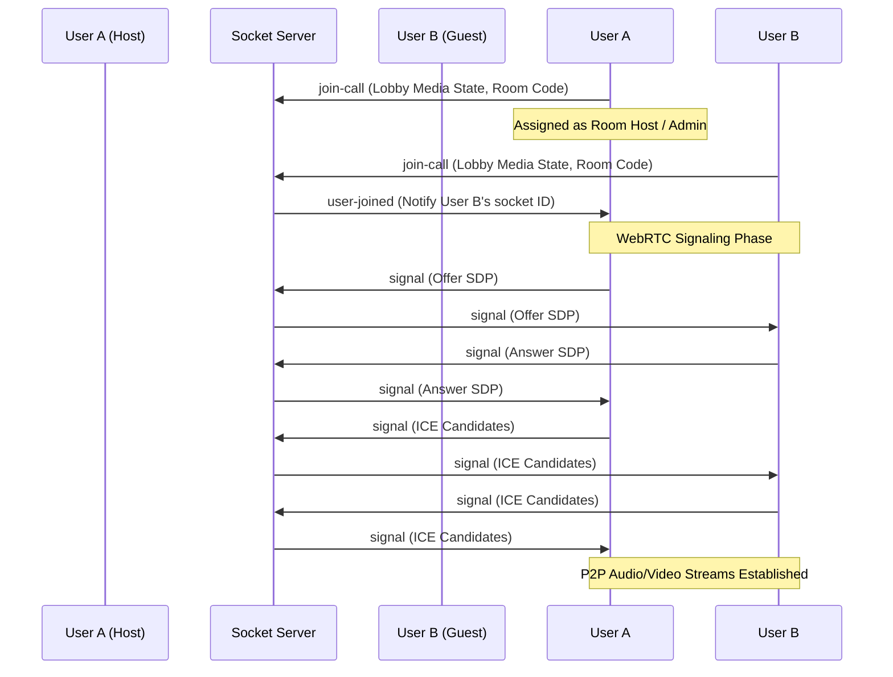

# <p align="center">🌌 MeetSpace 🌌</p>

<p align="center">
  <strong>MeetSpace</strong> is an enterprise-ready, premium, secure, and fully decentralized real-time video collaboration and meeting platform. Engineered with a robust, modern full-stack architecture, it provides seamless high-performance peer-to-peer audio and video streaming, dynamic active speaker detection, floating real-time emoji reactions, persistent in-meeting personal notes, and fully local client-side call recording utilizing browser APIs.
  <br/><br/>
  Designed for modern collaboration, MeetSpace allows users to securely authenticate via standard credentials or Google OAuth, quickly host or join rooms with custom randomized meeting codes, manage session participants through advanced host transfers, and track call histories with rich search, sorting, and filtering capabilities.
</p>

---

## 🚀 Tech Stack & Core Technologies

<p align="center">
  
  
  
  
  <br/>
  
  
  
  
</p>

---

## ⭐ Key Highlights

* **Direct Peer-to-Peer Mesh Streaming:** Decentralized high-definition WebRTC video and audio channels that minimize latency and server overhead.
* **Preserved Lobby Controls:** Configure your microphone and camera on the join page, and enter the meeting room with your exact configuration preserved.
* **Request & Transfer Host Access:** 
  - The first user to join a room is automatically assigned as the Admin/Host.
  - Remote users can **Request Admin Access** with one click.
  - The active Host receives an interactive dialog modal to accept (transfer privileges) or decline.
  - Host rights automatically transition to the next participant if the current host leaves.
* **Active Speaker Detection:** Real-time Web Audio API frequency analysis highlights the speaking user with a dynamic glow border.
- **Client-Side IndexedDB Recording:** Call recordings are recorded directly from your media streams on the client side using the browser's `MediaRecorder` API and saved as Blobs to your browser's persistent `IndexedDB` storage, allowing video playback, downloads, and deletes from your personal dashboard without any server-side recording files.
- **Dynamic Emoji Reactions:** Broadcast visual reaction bubbles (👍, 👏, 🎉, ❤️, 😂, 😮) that float up across all participants' screens.
- **Persistent Personal Notes:** Take personal meeting notes that are automatically saved and persisted to the browser's local storage per room code.

---

## 📂 Project Directory Structure

```
MeetSpace/
├── backend/
│   ├── src/
│   │   ├── controllers/
│   │   │   ├── socketManager.js       # WebSocket connections signaling & host privileges
│   │   │   └── user.controller.js     # Rest APIs for profiles and meeting history
│   │   ├── models/
│   │   │   ├── meeting.model.js       # MongoDB Meeting schema
│   │   │   └── user.model.js          # MongoDB User schema
│   │   ├── routes/
│   │   │   └── users.routes.js        # Express endpoints
│   │   └── app.js                     # Server launcher & MongoDB connector
│   └── package.json                   # Backend dependencies
│
├── frontend/
│   ├── public/
│   │   ├── favicon.svg                # Brand icon logo
│   │   ├── index.html                 # HTML Template
│   │   └── manifest.json              # Web app manifest
│   ├── src/
│   │   ├── contexts/
│   │   │   └── AuthContext.jsx        # Auth state context wrapper
│   │   ├── pages/
│   │   │   ├── authentication.jsx     # Google & Email Login forms
│   │   │   ├── history.jsx            # Filter/sort meeting logs dashboard
│   │   │   ├── home.jsx               # Dashboard controls & local recording player
│   │   │   ├── landing.jsx            # Product landing page
│   │   │   └── VideoMeet.jsx          # Live meeting client (WebRTC, notes, socket events)
│   │   ├── styles/
│   │   │   └── videoComponent.module.css # Component styles
│   │   ├── utils/
│   │   │   ├── firebase.js            # Firebase App initialization
│   │   │   └── recordingsDB.js        # IndexedDB wrapper for local call recordings
│   │   └── App.js                     # Main Router layout
│   └── package.json                   # Frontend dependencies
```

---

## 🔄 Real-Time Communication Workflow

MeetSpace establishes mesh WebRTC peer connections using a Socket.io signaling server:



---

## 🛠️ API Overview

All backend endpoints reside under `/api/v1/users` and use rate-limiting and authorization tokens where applicable.

| Endpoint | Method | Auth | Description |
| :--- | :--- | :--- | :--- |
| `/firebase-login` | `POST` | Public | Authenticates Firebase ID tokens and returns a local session token. |
| `/add_to_activity` | `POST` | JWT | Adds a meeting entry to the user's history log. |
| `/get_all_activity` | `GET` | JWT | Retrieves all meeting history logs for the user. |
| `/get_user_profile` | `GET` | JWT | Fetches detailed profile statistics of the logged-in user. |
| `/update_activity` | `POST` | JWT | Periodically updates session metrics (duration, participants, chats) in background. |
| `/delete_activity` | `POST` | JWT | Removes a meeting entry from the user's history. |

---

## 💻 Setup & Installation

### Prerequisites
- [Node.js](https://nodejs.org/) (v16+)
- [MongoDB](https://www.mongodb.com/) (Local server or Atlas URL)
- A [Firebase Project](https://console.firebase.google.com/) with Google Sign-in enabled

### 1. Clone the Repository
```bash
git clone https://github.com/Shivangi1515/MeetSpace.git
cd MeetSpace
```

### 2. Configure the Backend
1. Install dependencies using the `npm-requirements.txt` file:
   ```bash
   cd backend
   npm install $(cat npm-requirements.txt)
   ```
2. Create a `.env` file inside the `backend` folder:
   ```env
   PORT=8000
   MONGO_URL=your_mongodb_connection_string
   JWT_SECRET=your_custom_jwt_secret_phrase
   ```
3. Generate a Firebase service account private key JSON file from the Firebase console, name it `firebase-service-account.json`, and place it directly in the `backend/` directory.

### 3. Configure the Frontend
1. Install dependencies using the `npm-requirements.txt` file:
   ```bash
   cd ../frontend
   npm install $(cat npm-requirements.txt)
   ```
2. Create a `.env` file in the `frontend` folder:
   ```env
   REACT_APP_FIREBASE_API_KEY=your_firebase_api_key
   REACT_APP_FIREBASE_AUTH_DOMAIN=your_project_auth_domain
   REACT_APP_FIREBASE_PROJECT_ID=your_project_id
   REACT_APP_FIREBASE_STORAGE_BUCKET=your_storage_bucket
   REACT_APP_FIREBASE_MESSAGING_SENDER_ID=your_messaging_sender_id
   REACT_APP_FIREBASE_APP_ID=your_app_id
   REACT_APP_FIREBASE_MEASUREMENT_ID=your_measurement_id
   ```

### 4. Running the Application
1. **Start the Backend:**
   ```bash
   cd backend
   npm run dev
   ```
2. **Start the Frontend:**
   ```bash
   cd frontend
   npm start
   ```

---

## 🔑 Environment Variables Guide

### Backend Environment Variables (`backend/.env`)
- `PORT`: The port the backend express server runs on (defaults to `8000`).
- `MONGO_URL`: Your MongoDB connection connection string (local instance or cloud MongoDB Atlas cluster).
- `JWT_SECRET`: A secure custom salt key string used to encrypt local meeting history and session tokens.

### Frontend Environment Variables (`frontend/.env`)
- `REACT_APP_FIREBASE_API_KEY`: Google Firebase web app authorization key.
- `REACT_APP_FIREBASE_AUTH_DOMAIN`: Authorized Firebase project redirection domain.
- `REACT_APP_FIREBASE_PROJECT_ID`: Unique Firebase project identifier.
- `REACT_APP_FIREBASE_STORAGE_BUCKET`: Google storage cloud bucket endpoint.
- `REACT_APP_FIREBASE_MESSAGING_SENDER_ID`: Unique sender ID key for push alerts.
- `REACT_APP_FIREBASE_APP_ID`: App-specific configuration identification hash.
- `REACT_APP_FIREBASE_MEASUREMENT_ID`: Google analytics tracker token.

---

## 📖 Step-by-Step Usage Guide

### 1. Sign-in & Authentication
- Launch the application and click **Get Started** or **Login**.
- Select **Continue with Google** to log in instantly via federated credentials, or register with a unique Email & Password.

### 2. Room Navigation
- From your dashboard home page, click **New Meeting** to automatically generate a randomized `xxx-xxx-xxx` meeting code.
- Alternatively, paste an existing meeting code in the join input and click **Join**.

### 3. Joining Lobby Config
- Check your camera and microphone status inside the Lobby Preview Card.
- Toggle controls to your preferred default joining states.
- Type in your Display Name and click **Enter Meeting Room**.

### 4. Meeting Controls
- **Toolbar Toggles:** Enable or disable camera and microphone streams, share your screen, or float active emoji reactions.
- **Participants List:** View a list of current participants. If you are not the administrator, click **Request Admin Access**. If you are the Host, hover over any participant to transfer host permissions.
- **Meeting Notes:** Open the sidebar tab to record personal text notes. They are saved automatically to your browser storage per room code.
- **Local Recording:** Click the record button to capture the call. Once stopped, your recording is saved to the local IndexedDB database and can be replayed or downloaded from the dashboard.

---

## 🌟 Standout Engineering Highlights

- **Client-Side IndexedDB Recording Store:** Call recordings capture raw screen and microphone MediaStreams directly inside the browser. High-performance chunk conversion stores video logs directly to browser IndexedDB databases without eating up server storage or bandwidth.
- **Interactive Host Privilege Management:** WebSockets (Socket.io) handle real-time signaling to prompt hosts when guest permissions are requested, ensuring access rules are maintained dynamically.
- **Dynamic Voice Activity Glow:** Integrates the browser's Web Audio API `AudioContext` to analyze microphone frequency inputs in real time, outlining the active speaker with a dynamic visual glow.

---

## 🚀 Future Enhancements

- **Selective Forwarding Unit (SFU) Integration:** transition from mesh WebRTC to SFU-based audio/video routing to support large scale calls.
- **Dynamic Whiteboard Canvas:** Collaborative drawing board for team meetings.
- **Automated AI Call Transcriptions:** Text translations based on microphone tracks during meetings.

