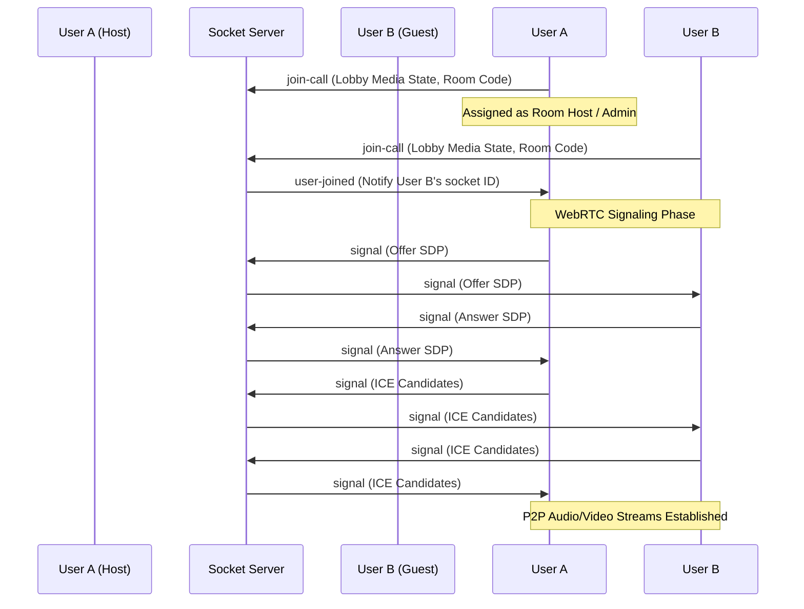

# MeetSpace

MeetSpace is a premium, secure, and developer-friendly real-time video collaboration and meeting platform. Designed as a robust full-stack solution, it combines high-performance WebRTC peer-to-peer audio/video streaming, active speaker detection, live text messaging, in-meeting reaction overlays, personal notes persistence, and client-side meeting recording.

---

## Table of Contents
- [Key Features](#key-features)
- [Architecture & Tech Stack](#architecture--tech-stack)
- [Project Directory Structure](#project-directory-structure)
- [Real-Time Communication Workflow](#real-time-communication-workflow)
- [Database Schema & Models](#database-schema--models)
- [API Overview](#api-overview)
- [Setup & Installation](#setup--installation)
- [Environment Variables](#environment-variables)
- [Usage Guide](#usage-guide)
- [Standout Engineering Highlights](#standout-engineering-highlights)
- [Future Enhancements](#future-enhancements)
- [Contributing](#contributing)
- [License](#license)
- [Author](#author)

---

## Key Features

### 🛡️ Authentication & User Access
- **Federated Login:** Seamless authentication using Google Sign-In powered by Firebase Authentication.
- **Classic Email/Password:** Secure sign-up and login with password hashes securely verified on top of Firebase infrastructure.
- **Session Tokens:** Custom Node.js/Express backend that validates Firebase ID tokens and issues local JSON Web Tokens (JWT) for secure Mongo database access.

### 🎥 Live Meeting Experience
- **Preserved Lobby Settings:** Join-lobby preview where you can toggle your camera and microphone. Your exact lobby settings are preserved when entering the meeting room.
- **Admin (Host) Controls:** The first participant to enter the meeting becomes the Admin (Host). 
  - Hosts can transfer admin privileges directly to any remote user in the participants tab.
  - Remote users can **Request Admin Access** via a button, sending a real-time modal prompt to the current host to accept or decline.
  - Privilege auto-transfers to the next available participant if the host disconnects.
- **Active Speaker Tracking:** Automatic visual speaker highlight using the Web Audio API to detect voice activity in real time.
- **Spotlight vs. Grid Layout:** Easily pin or unpin any participant (including yourself) to switch between standard grid view and focused spotlight layout.

### 💬 Real-Time Collaboration
- **In-Call Chat:** Instant message delivery to all room members via WebSockets.
- **Emoji Reactions:** Float visual reaction bubbles (👍, 👏, 🎉, ❤️, 😂, 😮) dynamically across all participants' screens.
- **Persistent Personal Notes:** Take personal meeting notes that are automatically saved and persisted to the browser's local storage per room code.
- **Meeting Recording:** Locally record video calls directly to your browser's persistent IndexedDB storage using the browser's MediaStream Recording API. Features an integrated video player on the dashboard to replay, download, or delete saved meetings.

### 📊 Meeting Logs & History
- **Automatic History Sync:** Periodic background session sync (every 15 seconds) to sync duration, active participant counts, chat counts, and titles to prevent stale logs.
- **Advanced History Dashboard:** Search, filter logs by timeframe (today, week, month), sort by duration or participants, delete entries, or pin important codes to the top of your dashboard.

---

## Architecture & Tech Stack

MeetSpace is built with a decoupled client-server architecture:

| Component | Technology | Description |
| :--- | :--- | :--- |
| **Frontend** | React, React Router Dom v7 | Single Page Application framework with client-side routing. |
| **UI Library** | Material UI (MUI), Emotion | Sleek styling, custom theme tokens, and modern visual cards. |
| **Backend** | Node.js, Express.js | API server and REST endpoint routing. |
| **Real-Time** | WebSockets (Socket.io) | Signaling server for WebRTC negotiations, chat, and room states. |
| **Streaming** | WebRTC (Simple RTCPeerConnection) | Direct peer-to-peer streaming of high-quality video & audio. |
| **Database** | MongoDB, Mongoose | Persistence layer for meeting logs and user profiles. |
| **Authentication** | Firebase Auth (Client & Admin SDK) | External identity provider and secure token generation. |
| **Persistence** | Browser IndexedDB, LocalStorage | Client-side database for recording file blobs and personal notes. |

---

## Project Directory Structure

```
MeetSpace/
├── backend/
│   ├── src/
│   │   ├── controllers/
│   │   │   ├── socketManager.js       # Socket.io connection signaling & host roles
│   │   │   └── user.controller.js     # User profiles, Firebase login sync & history REST APIs
│   │   ├── models/
│   │   │   ├── meeting.model.js       # Mongoose Meeting schema (stats, codes, metadata)
│   │   │   └── user.model.js          # Mongoose User schema (identity and auth tokens)
│   │   ├── routes/
│   │   │   └── users.routes.js        # REST endpoints and rate-limiters
│   │   └── app.js                     # Server launcher, DB connection & Socket initializer
│   ├── firebase-service-account.json  # Firebase credentials (ignored)
│   └── package.json                   # Backend server dependencies
│
├── frontend/
│   ├── public/
│   │   ├── favicon.svg                # Brand icon logo
│   │   ├── index.html                 # Main HTML template
│   │   └── manifest.json              # Web app manifest properties
│   ├── src/
│   │   ├── contexts/
│   │   │   └── AuthContext.jsx        # Authentication wrapper, storage, and API services
│   │   ├── pages/
│   │   │   ├── authentication.jsx     # Google & Email Login forms
│   │   │   ├── history.jsx            # Advanced search/sort/filter meeting history dashboard
│   │   │   ├── home.jsx               # Dashboard controls & local recording player
│   │   │   ├── landing.jsx            # Landing page
│   │   │   └── VideoMeet.jsx          # Meeting client (WebRTC, notes, socket events, recording)
│   │   ├── styles/
│   │   │   └── videoComponent.module.css # Stylesheet for call view components
│   │   ├── utils/
│   │   │   ├── firebase.js            # Firebase App initialization
│   │   │   └── recordingsDB.js        # IndexedDB wrapper for local call recordings
│   │   ├── App.js                     # Main Router layout
│   │   └── index.js                   # Client bundle initializer
│   └── package.json                   # Frontend dependencies and scripts
```

---

## Real-Time Communication Workflow

MeetSpace establishes mesh WebRTC peer connections using a Socket.io signaling server:



1. **Room Join:** Clients execute `join-call` transmitting credentials. The server tracks and broadcasts a unified `participant-list` specifying the active Host.
2. **SDP Exchange:** The joining peer receives active connection IDs and initiates an `RTCPeerConnection` for each client. Offers and Answers are passed back and forth through the socket server.
3. **ICE Candidates:** Interactive Connectivity Establishment (ICE) candidates are generated and relayed to negotiate network routes.
4. **Mesh Streaming:** Peer-to-peer streams are bound to local UI components once negotiations complete.

---

## Database Schema & Models

### User Schema (`user.model.js`)
Stores authenticated user records synced from Firebase login payloads.
```json
{
  "name": "String (required)",
  "username": "String (required, unique)",
  "password": "String (required, hashed)",
  "email": "String (unique, sparse)",
  "isEmailVerified": "Boolean (default: false)",
  "token": "String",
  "verificationToken": "String",
  "resetPasswordToken": "String",
  "resetPasswordExpires": "Date"
}
```

### Meeting Schema (`meeting.model.js`)
Logs session metrics for historical statistics.
```json
{
  "user_id": "String",
  "meetingCode": "String (required)",
  "date": "Date (default: Date.now)",
  "duration": "Number (seconds, default: 0)",
  "participantsCount": "Number (default: 1)",
  "chatCount": "Number (default: 0)",
  "meetingTitle": "String (default: 'MeetSpace Session')"
}
```

---

## API Overview

All backend endpoints reside under `/api/v1/users` and use rate-limiting and authorization tokens where applicable.

| Endpoint | Method | Auth | Description |
| :--- | :--- | :--- | :--- |
| `/firebase-login` | `POST` | Public | Authenticates Firebase ID tokens and returns a local session token. |
| `/add_to_activity` | `POST` | JWT | Adds a meeting entry to the user's history log. |
| `/get_all_activity` | `GET` | JWT | Retrieves all meeting history logs for the user. |
| `/get_user_profile` | `GET` | JWT | Fetches detailed profile statistics of the logged-in user. |
| `/update_activity` | `POST` | JWT | Periodically updates session metrics (duration, participants, chats) in background. |
| `/delete_activity` | `POST` | JWT | Removes a meeting entry from the user's history. |

---

## Setup & Installation

Follow these steps to run MeetSpace locally on your machine:

### Prerequisites
- [Node.js](https://nodejs.org/) (v16+ recommended)
- [MongoDB](https://www.mongodb.com/) (Local server or MongoDB Atlas URL)
- A [Firebase Project](https://console.firebase.google.com/) with Google Sign-in enabled

### 1. Clone the Repository
```bash
git clone https://github.com/Shivangi1515/MeetSpace.git
cd MeetSpace
```

### 2. Configure the Backend
1. Navigate to the backend directory and install dependencies:
   ```bash
   cd backend
   npm install
   ```
2. Create a `.env` file inside the `backend` folder:
   ```env
   PORT=8000
   MONGO_URL=your_mongodb_connection_string
   JWT_SECRET=your_custom_jwt_secret_phrase
   ```
3. Generate a Firebase service account private key JSON file from the Firebase console (*Project Settings -> Service Accounts*), name it `firebase-service-account.json`, and place it directly in the `backend/` directory.

### 3. Configure the Frontend
1. Navigate to the frontend directory and install dependencies:
   ```bash
   cd ../frontend
   npm install
   ```
2. Create a `.env` file in the `frontend` folder:
   ```env
   REACT_APP_FIREBASE_API_KEY=your_firebase_api_key
   REACT_APP_FIREBASE_AUTH_DOMAIN=your_project_auth_domain
   REACT_APP_FIREBASE_PROJECT_ID=your_project_id
   REACT_APP_FIREBASE_STORAGE_BUCKET=your_storage_bucket
   REACT_APP_FIREBASE_MESSAGING_SENDER_ID=your_messaging_sender_id
   REACT_APP_FIREBASE_APP_ID=your_app_id
   REACT_APP_FIREBASE_MEASUREMENT_ID=your_measurement_id
   ```

### 4. Running the Application
1. **Start the Backend server:**
   ```bash
   cd backend
   npm run dev
   ```
   The backend should start on `http://localhost:8000`.
2. **Start the Frontend development server:**
   ```bash
   cd frontend
   npm start
   ```
   The frontend should spin up on `http://localhost:3000`.

---

## Environment Variables

### Backend Environment Variables
| Variable | Description |
| :--- | :--- |
| `PORT` | The port the Express backend server listens on (defaults to 8000). |
| `MONGO_URL` | MongoDB connection URI string for persistence. |
| `JWT_SECRET` | Secret string key used for signing local session web tokens. |

### Frontend Environment Variables
| Variable | Description |
| :--- | :--- |
| `REACT_APP_FIREBASE_API_KEY` | Firebase API Key. |
| `REACT_APP_FIREBASE_AUTH_DOMAIN` | Firebase Authentication Domain. |
| `REACT_APP_FIREBASE_PROJECT_ID` | Firebase Project ID. |
| `REACT_APP_FIREBASE_STORAGE_BUCKET` | Firebase Storage Bucket. |
| `REACT_APP_FIREBASE_MESSAGING_SENDER_ID` | Firebase Messaging Sender ID. |
| `REACT_APP_FIREBASE_APP_ID` | Firebase App ID. |
| `REACT_APP_FIREBASE_MEASUREMENT_ID` | Firebase Google Analytics Measurement ID. |

---

## Screenshots / Preview Placeholders

This section outlines screenshots you can link in the repository assets directory:

- **Lobby View:** ``
  *The preview card where users configure their camera and microphone before joining.*
- **Meeting Room Grid:** ``
  *Mesh grids displaying multiple concurrent video tiles with active speaker glowing borders.*
- **Host Transfer & Requests:** ``
  *The host confirmation dialog popover indicating a guest has requested admin privileges.*
- **Searchable Logs Dashboard:** ``
  *Dashboard filtering and sorting previous meeting logs, pinned sessions, and durations.*

---

## Usage Guide

1. **Sign In:** Go to the application homepage and sign in using **Continue with Google** or register a new account.
2. **Dashboard Actions:** 
   - Enter a custom code in the text field and click **Join** to access a specific room.
   - Click **New Meeting** to automatically generate a unique meeting code and navigate to the lobby.
3. **Lobby Check:** Confirm your camera and microphone are toggled to your preferred states. Enter your display name and click **Enter Meeting Room**.
4. **In-Call Interface:**
   - Use the bottom toolbar to toggle audio, video, screen sharing, reactions, or screen recording.
   - Expand the right-hand sidebar to view the **Chat Room**, **Participants List** (view or request Host privileges), or record personal **Meeting Notes**.
5. **View Activity Logs:** Click the history clock icon on the home dashboard to view, sort, search, pin, or clean previous meeting details.

---

## Standout Engineering Highlights

- **Mesh Topology Real-Time Client:** Fully decentralized WebRTC media routing using direct P2P data streams to reduce server-side load.
- **Client-Side IndexedDB Recording:** Call recordings are captured directly on the client side using the browser's `MediaRecorder` API and saved as Binary Large Objects (Blobs) in the browser's local `IndexedDB` storage, allowing video review and downloads without server-side processing overhead.
- **Web Audio API VAD (Voice Activity Detection):** Utilizes standard AudioContext analyzer nodes to detect frequency changes in local and remote microphone tracks, highlighting the active speaker with a dynamic UI glow.
- **State Preservation Pipeline:** Smooth transition from lobby preview elements to active peer streams, ensuring microphone and camera disable instructions are maintained when entering rooms.

---

## Future Enhancements
- **Multi-Peer SFU/MCU Integration:** Transitioning from mesh topology to a Selective Forwarding Unit (SFU) architecture to scale to larger room sizes.
- **Rich Collaborative Whiteboard:** Real-time canvas sharing for teams during meetings.
- **Group Breakout Rooms:** Dynamic creation of sub-meetings within a primary call.
- **Automated AI Transcriptions:** Text transcripts based on microphone tracks during meetings.

---

## Contributing

1. **Fork** the repository.
2. Create your feature branch (`git checkout -b feature/NewFeature`).
3. Commit your changes (`git commit -m 'feat: add some new feature'`).
4. Push to the branch (`git push origin feature/NewFeature`).
5. Open a **Pull Request**.

---

## License

This project is licensed under the MIT License - see the [LICENSE](LICENSE) file for details.

---

## Author

- **GitHub:** [@Shivangi1515](https://github.com/Shivangi1515)
- **LinkedIn:** [Your Name](https://linkedin.com/in/your-profile)
- **Email:** shivangi@example.com
